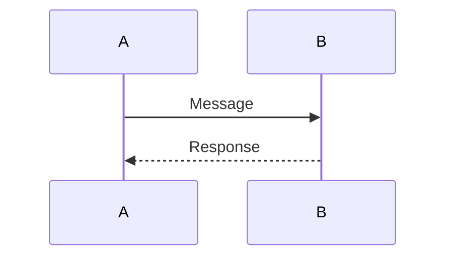

# Markdown book generation

## HTML generation

```sh
uv run bookgen.py -o PATH_TO_TARGET_HTML PATH_TO_BOOK_SOURCE
```

Example:
```sh
uv run bookgen.py -o html doc
```

All .md and .ipynb files in the selected directory will be in the single-file book. Sorted order of file names defines the order of content in the book (use number prefixes for file names to define the desired order of content).

## Image support


## TeX foruma support

Equation:
$$ \sum_{i=1}^{\infty} x_i $$

Inline equation: $e^x$

## Mermaid support

Mermaid is supported only in HTML version.


