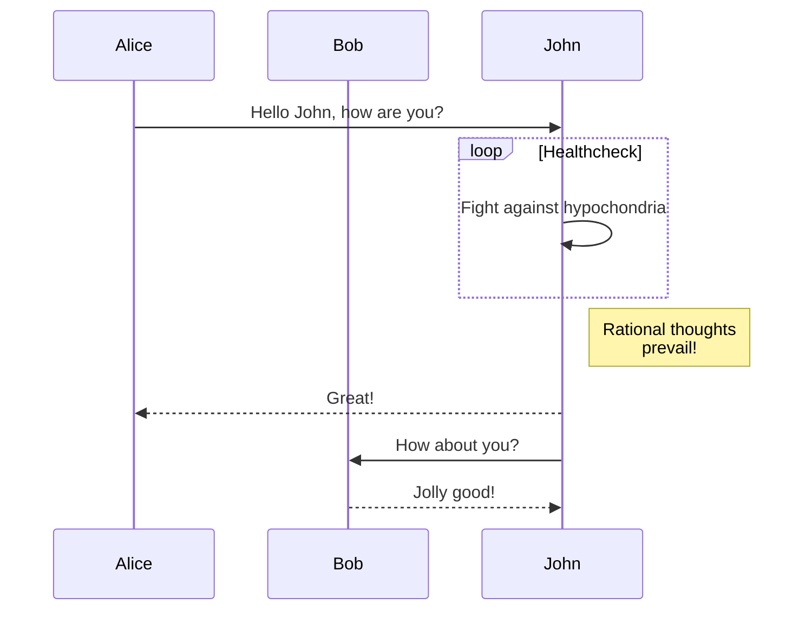

# Markdown book generation

Usage: `pipenv run ./bookgen.py {path-to-book-source}`

All .md files in the selected directory will be in the single-file HTML book. Sorted order of file names defines the order of content in the book (use number prefixes for file names to define the desired order of content).

## Image support

## TeX foruma support

Equation:
$$ \sum_{i=1}^{\infty} x_i $$

Inline equation: $ e^x $

## Mermaid support

