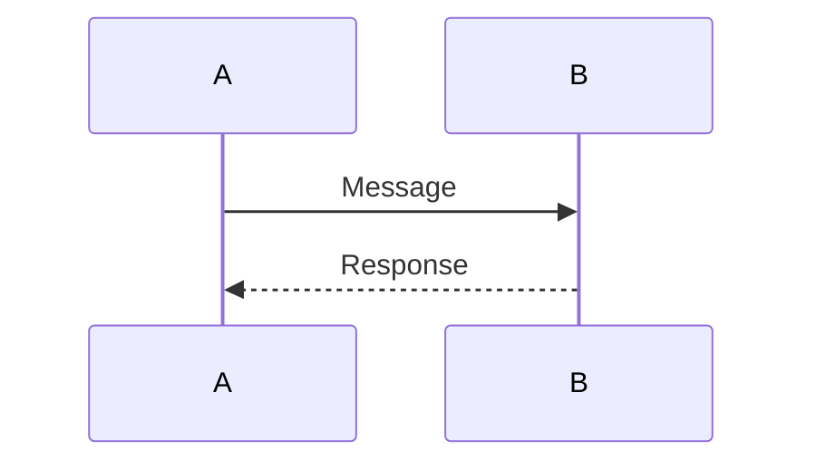

# Markdown book generation

All .md and .ipynb files in the selected directory will be in the single-file book. Sorted order of file names defines the order of content in the book (use number prefixes for file names to define the desired order of content).

## HTML generation

```sh
pipenv run -t html ./bookgen.py {path-to-book-source}
```

## PDF generation

```sh
pipenv run ./bookgen.py {path-to-book-source} -o {path--to-book-output}`
cd {path--to-book-output}
pandoc book.md -o book.pdf
```

## Image support


## TeX foruma support

Equation:
$$ \sum_{i=1}^{\infty} x_i $$

Inline equation: $e^x$

## Mermaid support

Mermaid is supported only in HTML version.


